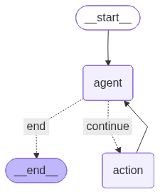

# Agentic RAG Chatbot

This repository provides an **Agentic RAG (Retrieval-Augmented Generation)** chatbot that leverages a **ReAct agent graph workflow** to answer domain-specific agricultural questions using a **local knowledge base**.  

The system combines **OpenAI's GPT-3.5-turbo** with an **efficient embedding and indexing pipeline** tailored for the Ukrainian language, ensuring high-quality retrieval and accurate responses.

---

## Key Features

- **Agentic ReAct Graph**  
  Iterative reasoning + retrieval that refines answers until the response satisfies the user’s query.

- **LLM Backbone**  
  OpenAI `gpt-3.5-turbo` via API for natural language generation.

- **Embedding Model**  
  `BAAI/bge-m3` (SOTA open-source embeddings with strong Ukrainian support).

- **Tokenizer**  
  `XLMRobertaTokenizer` for robust Ukrainian text handling.

- **Chunking**  
  **Recursive Character Text Splitter** to preserve local context while splitting long documents.

- **Indexing & Retrieval**  
  **FAISS (HNSW)** for fast, semantically accurate nearest-neighbor search.

---

## Architecture



*ReAct agent iteratively retrieves relevant chunks from the Knoewladge Base, reasons over them, and composes the final answer.*

---

## Project Structure

```text
AgenticRAG
├── data/                      # Raw and processed datasets
├── FAISS/                     # Vector index storage (index + metadata)
├── src/core/                  # Core application code
│   ├── config/                # Configuration modules
│   ├── services/              # Domain services
│   │   ├── agent_service/     # ReAct agent logic
│   │   ├── index_service/     # Embedding, indexing, retrieval
│   │   └── preprocessing_service/  # Text cleaning, splitting
│   └── endpoints/             # API endpoints (FastAPI)
├── venv/                      # Python virtual environment (local)
├── .env                       # Local environment variables
├── .gitignore                 # Git ignore rules
├── README.md                  # This file
├── requirements.txt           # Python dependencies
└── graph.png                  # Architecture diagram
```

---

## Prerequisites
```text
Python: 3.10 or higher

GPU: Optional (CPU is sufficient)
```

---

## Installation

Clone & enter the repo

```bash
git clone https://github.com/Kimiko12/AgenticRAG.git
cd AgenticRAG
```

Create a virtual environment & install deps
```bash
python3 -m venv venv
source venv/bin/activate
pip install -r requirements.txt
```

Create the .env file
```bash
touch .env
```

---

## Configuration Parameters
| Parameter          | Default                              | Description                                              |
| ------------------ | ------------------------------------ | -------------------------------------------------------- |
| `data_path`        | `BASE_DIR / "data/row"`              | Path with raw input documents                            |
| `output_data_path` | `BASE_DIR / "data/clean"`            | Output path for cleaned/normalized data                  |
| `chunk_size`       | `700`                                | Chunk size for the text splitter                         |
| `chunk_overlap`    | `100`                                | Overlap between consecutive chunks                       |
| `embedding_model`  | `"BAAI/bge-m3"`                      | Embedding model name (Hugging Face)                      |
| `index_path`       | `BASE_DIR / "FAISS/faiss_index.bin"` | Binary file path for FAISS index                         |
| `meta_path`        | `BASE_DIR / "FAISS/faiss_meta.json"` | Metadata (mapping chunk → doc info)                      |
| `graph_path`       | `BASE_DIR / "graph.png"`             | Path to architecture diagram                             |
| `alpha`            | `0.7`                                | Weight for rank fusion (if using RRF/ensemble retrieval) |
| `M`                | `16`                                 | HNSW graph degree (FAISS)                                |
| `efConstruction`   | `200`                                | HNSW construction parameter (FAISS)                      |


---

## Environment Variables

Add the following to .env:
```bash
OPENAI_API_KEY=your_api_key_here
OPENAI_MODEL_NAME=gpt-3.5-turbo
```

---

## Data Preparation

Create the raw data folder (if it doesn’t exist):
```bash
mkdir -p data/row
```
Put your domain documents (html or pdf files) into data/row/.

The preprocessing pipeline will clean + chunk documents into data/clean/ and build/update the FAISS index in FAISS/.

---

First run:
```bash
load_index=False,
save_index=True
```

For the rest runs:
```bash
load_index=True,
save_index=False
```

## Run the Service

Start the FastAPI app:
```bash
python3 src/core/endpoints/qa_endpoint.py
```

---

## Request Body (JSON)
```json
{
  "question": "Як впливає розміщенні кукурудзи після цукрових буряків на почву?",
  "top_k": 3,
  "max_iterations": 3
}
```
- question (string, required): user query
- top_k (int, default=3): number of top relevant chunks to retrieve
- max_iterations (int, default=3): max retrieval/agent iterations

---

## Output Example
```json
{
    "question": "Як впливає розміщенні кукурудзи після цукрових буряків на почву?",
    "answer": "Розміщення кукурудзи після цукрових буряків може мати певний вплив на почву. При такій сівозміні погіршуються умови живлення, зокрема знижується засвоюваність фосфатів. Кукурудзу можна вирощувати на постійному місці, оскільки вона добре переносить монокультуру. Для отримання високих врожаїв важливо створити гарний агрофон з відповідною системою удобрень і підготовкою ґрунту. Також у посіві кукурудзи є можливість ефективного контролю бур'янів. Залишки рослин, що залишаються на полі після збирання урожаю, можуть покращувати органічну частину ґрунту."
}
```

---

## Improvments:
- Add semantic chunking for improved context handling
- Implement full-text and hybrid search
- Experiment with different tokenizers & embedding models
- Integrate agentic data cleaning into the pipeline
- Experiment with different multilingual LLMs
- Explore alternative agent architectures
- Integrate LangSmith for monitoring and traceability
- Develop a web UI for user interaction
- Add async support for improved performance for future Agentic architecture, if it will be appropriately